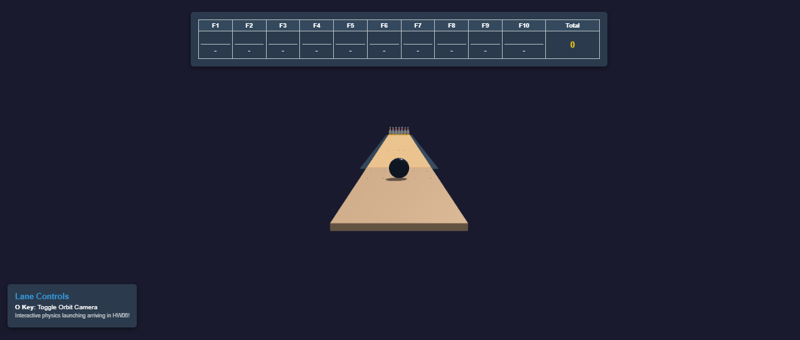
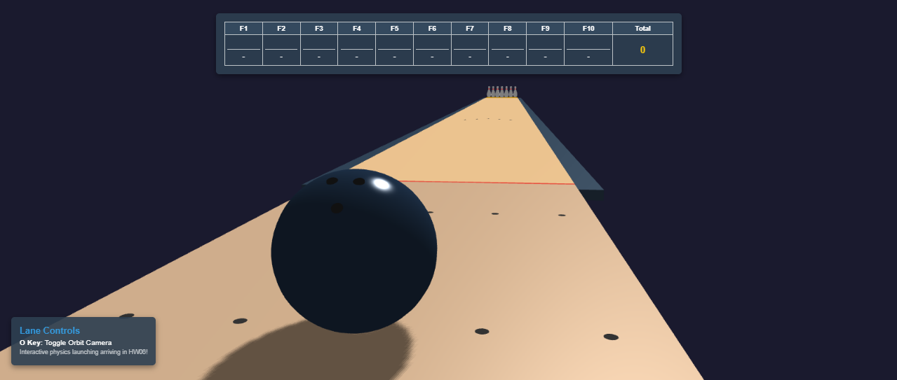
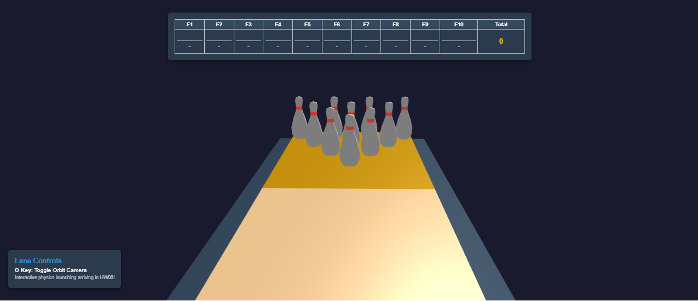
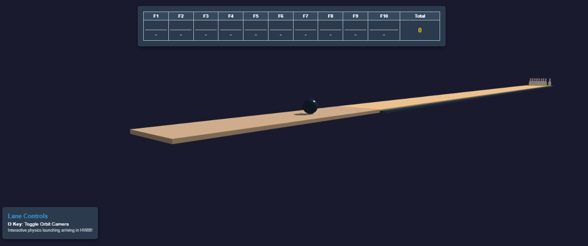

# Computer Graphics - Exercise 5 - WebGL Bowling Alley

## Getting Started
1. Clone this repository to your local machine
2. Make sure you have Node.js installed
3. Start the local web server: `node index.js`
4. Open your browser and go to http://localhost:8000

## Complete Instructions
**All detailed instructions, requirements, and specifications can be found in:**
`bowling_exercise_instructions.html`

## Group Members
**MANDATORY: Add the full names of all group members here:**
- Omer Dahan

## Technical Details
- Run the server with: `node index.js`
- Access at http://localhost:8000 in your web browser

---

## Features Implemented
* **Bowling Lane Infrastructure:** Built a 60-unit wooden lane with gutters, a red foul line, and a targeted pin deck.
* **10-Pin Regulation Array:** Procedurally generated a 4-row equilateral triangle of custom-proportioned bowling pins with red neck-stripe details.
* **3-Hole Bowling Ball:** Modeled a high-gloss bowling ball featuring 3 distinct black finger holes (two adjacent grips and an offset thumb hole) facing the camera.
* **Interactive Camera Controls:** Standard `OrbitControls` toggleable with the `O` key, customized to dynamically shift target focus straight down to the pins for seamless zooming.
* **Scorecard HUD UI:** A responsive, absolute-positioned HTML scorecard tracker overlaid cleanly on top of the WebGL canvas.

---

## Mandatory Project Screenshots

### 1. Overall View

### 2. Ball Approach & Finger Holes

### 3. Pins Close-up Formation

### 4. Camera Controls Demonstration
